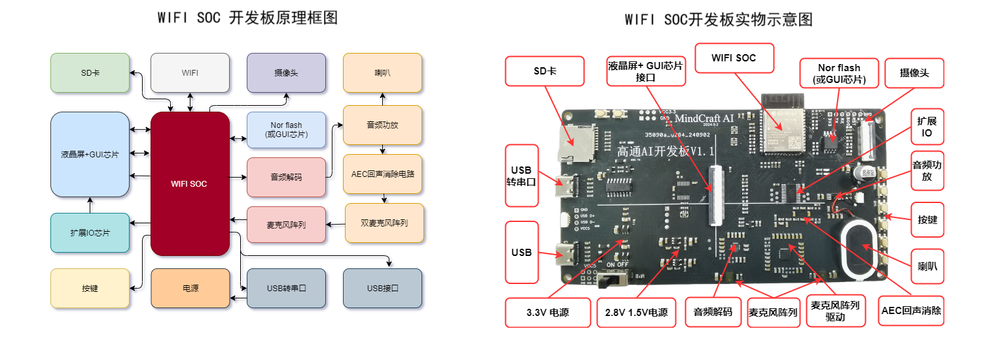

 

    

 

  <a><b>GT-HMI Builder-开源硬件系列</b></a>

  <a><b>致力于低代码开发，多功能，易用的免费嵌入式图形库</b></a>

---

 

    <a href="https://www.hmi.gaotongfont.cn/kfgj"
    > 公司官网 </a> |
    <a href="https://space.bilibili.com/3493293474188211/video"
    > B 站教程 </a> |
    <a href="https://www.hmi.gaotongfont.cn/kfgj#/#hmiEngine"
    > Engine 使用手册 </a> |
    <a href="https://www.hmi.gaotongfont.cn/kfgj#/#hmidesigner"
    > Designer 使用手册 </a> |
    <a href="http://isite.baidu.com/site/wjz7qkrv/406a2b0c-f9c7-4a08-a47a-662e862b2af4?ch=48&wid=498ccd5c05334f21a2142ba3cf628964_0_0&field=&orderBy=&categoryId=undefined&title=%E8%81%94%E7%B3%BB%E6%88%91%E4%BB%AC"
    > 联系方式 </a> |
    <a href="https://genitop-1317577547.cos.ap-nanjing.myqcloud.com/GT-HMI/GT-HMI-Groups/GT-HMI%20Communication%20groups.jpg"
    > GT HMI微信交流群 </a>

 

#### 介绍
&nbsp;&nbsp;&nbsp;&nbsp;&nbsp;&nbsp;&nbsp;&nbsp;GT-HMI Builder是基于GT-HMI和智匠AI的开源硬件系列项目。chatbot文件夹内包括高通智匠AI开发板的硬件连接、软件示例以及界面设计，旨在帮助开发者快速理解和使用高通GT-HMI 工具及智匠AI的基础功能与示例。通过本项目，开发者可以学习如何利用高通GT-HMI平台及智匠AI构建的基于大模型的人机自然语言交互系统。

#### 硬件框图

    

#### 快速开始
<ul>
<li style="margin-bottom: 4px;">硬件准备：<ul>
<li>客户可参考本文件夹中Hardware文件夹下提供的硬件资料自己设计PCB板，</li><li>也可以使用高通智匠 AI开发板。</li></ul></li>
<li style="margin-bottom: 4px;">软件安装：<ul>
<li>HMI Designer 安装：从<a href="https://www.hmi.gaotongfont.cn" target="_blank">高通官网</a> www.hmi.gaotongfont.cn 下载并安装HMI-Designer软件。用于打开hmi-project文件夹中的 “AI机器人.gtui”工程文件。可以仿真查看本项目的上位机交互逻辑，某些功能上位机无法实现，需要下位机代码实现，具体请查看下位机的ESP32 IDF Project\components\GT\screen\代码及代码注释</li></ul>
<ul>
<li>ESP32 IDF 安装：参考ESP32 IDF Project文件夹中的 “ESP-IDF以及ESP-ADF的环境搭建”文档，需严格按照版本要求及步骤进行安装，如果已有5.14版本的ESP-IDF环境以及ESP-ADF环境，没有下载文档里面的环境，只需要打补丁即可，<a href="https://gitee.com/genitop/GT-HMI-Builder/tree/master/GT-MindCraft%20Embedded/chatbot/patch" target="_blank">补丁地址</a> (或复制https://gitee.com/genitop/GT-HMI-Builder/tree/master/GT-MindCraft%20Embedded/chatbot/patch) ，将补丁复制到esp-adf路径下面， 然后在git bash命令框下输入git apply 0001-add-esp32-s3-gt-borad.patch 和git apply 000l-add borad-esp_s3_gt_korvo2_v3.patch就可以加入补丁</li></ul></li>
<li style="margin-bottom: 4px;">移植：<ul>
<li>如使用高通智匠AI开发板，已经全部移植好，并有代码注释，直接运行即可，如使用其他ESP32开发板请参考如下建议。</li>
<li>GT-HMI Engine移植：请参考视频<a href="https://www.bilibili.com/video/BV1dBsVeDEMR/?share_source=copy_web&vd_source=51817f89c7e6ffe331e366d0963376b5" target="_blank">【在ESP32上移植GT-HMI Engine详细教程】</a> (或复制https://www.bilibili.com/video/BV1dBsVeDEMR/?share_source=copy_web&vd_source=51817f89c7e6ffe331e366d0963376b5)</li>
<li>ESP32外设移植：ESP32部分的外设在ADF框架下移植请参考乐鑫官方文档及示例,本开发板除电源、USB转TTL、扩展IO、 GUI-LCD接口和乐鑫官方推出的korvo2_v3开发板不同外，其余均大致相同，相同部分的外设及例程可参考乐鑫官方的korvo2_v3的例程进行开发。</li></ul></li>
<li style="margin-bottom: 4px;">WIFI参数及API KEY修改：<ul>
<li>流式和非流式模式：找到components\GT\GT_DRV\http_send.h文件，在文件中找到如下字段"#define USE_HTTP_STREAM 1 //使用流式代码宏,1:流式，0:非流式" 字段，设置成1则是流式模式，设置成0则为非流式模式。 推荐使用流式模式，上传数据和下发数据均较快速。</li>
<li>修改WIFI 名称及密码：找到components\GT\GT_DRV\wifi_config.c文件，在文件中找到如下字段#define DEFAULT SSID #define DEFAULT PWD字段，分别是WIFI名称和密码，修改成您使用的WIFI名称及密码。 </li>
<li>获取API KEY及修改API KEY：申请API KEY参考如下链接<a href="https://apifox.com/apidoc/shared-0fd7ea54-919e-4c93-b673-c60219bc82e0/doc-4739665" target="_blank">API KEY链接</a>(或复制 https://apifox.com/apidoc/shared-0fd7ea54-919e-4c93-b673-c60219bc82e0/doc-4739665)，然后找到components\GT\GT_DRV\Chttp_send.c 中的esp_http_client_set_header(client."Authorization","API keys");字段，将申请到的API KEY填入到API keys的位置</li>
</ul></li>
<li style="margin-bottom: 4px;">编译与下载：<ul>
<li>按照教程文档在VSCode安装好ESP32 IDF并修改好WIFI名称及密码 API KEY后，用VSCode 打开ESP32 IDF Project文件夹进行编译下载，具体步骤请参考“ESP-IDF以及ESP-ADF的环境搭建”文档</li>
<li>工程编译下载ESP32后需要将素材文件烧录到FLASH中，将board文件夹内的resource.bin文件使用esptool工具下载到 ESP32 模组中的FLASH中,esptool安装请参考如下链接：<a href="https://blog.csdn.net/qq_59527512/article/details/140307594" target="_blank">链接</a>(或复制https://blog.csdn.net/qq_59527512/article/details/140307594)，安装好后 运行命令 esptool.py --port COM12 write_flash 0x200000 resource.bin 将resource.bin烧录到FLASH中的0x200000地址，其中参数COM12请根据实际使用情况修改 </li>
<li>自行设计的PCB，需要根据主控厂商的文档进行编译和下载MCU执行文件，工程编译后将board文件夹内的resource.bin文件用烧录器或者自制升级程序烧录到GUI芯片当中</li></ul></li>
<li style="margin-bottom: 4px;">测试运行：<ul>
<li>下载后，点击界面下面的按钮控件，看是否能够正常切换界面及语音交互</li></ul></li>
</ul>

 

**视频教程，陆续发布，敬请期待**
<ul>
<li style="margin-bottom: 4px;"><a href="https://www.bilibili.com/video/BV1qP22YSEQW/?spm_id_from=333.337.search-card.all.click&vd_source=0d93f7ed5a2d40d6e2d321f392d5e6f3">高通智匠AI开发板：整体框架的环境搭建</a></li>
<li style="margin-bottom: 4px;"><a href="https://www.bilibili.com/video/BV1TGmGYgEAS/?spm_id_from=333.999.0.0&vd_source=0d93f7ed5a2d40d6e2d321f392d5e6f3">高通智匠AI开发板：GUI界面的设计流程</a></li>
<li style="margin-bottom: 4px;"><a href="https://www.bilibili.com/video/BV15jyPY9EfS/?spm_id_from=333.999.0.0&vd_source=0d93f7ed5a2d40d6e2d321f392d5e6f3">高通智匠AI开发板：链接AI云服务</a></li>
<li style="margin-bottom: 4px;"><a href="https://www.bilibili.com/video/BV15JyBYSEpA/?spm_id_from=333.999.0.0&vd_source=0d93f7ed5a2d40d6e2d321f392d5e6f3">高通智匠AI开发板：GUI界面与业务逻辑交互</a></li>
</ul>

**智匠chatbot API接口文档**

<ul>
<li style="margin-bottom: 4px;"><a href="https://apifox.com/apidoc/shared-0fd7ea54-919e-4c93-b673-c60219bc82e0/api-213657897">chat bot 参数获取</a></li>
<li style="margin-bottom: 4px;"><a href="https://apifox.com/apidoc/shared-0fd7ea54-919e-4c93-b673-c60219bc82e0/api-213657897">chat_bot_v1 API接口及示例</a></li>
</ul>

 

**智匠AI KEY申请流程**

<ul>
<li style="margin-bottom: 4px;"><a href="https://apifox.com/apidoc/shared-0fd7ea54-919e-4c93-b673-c60219bc82e0/doc-4739665">如何获取API KEY</a></li>
</ul>

