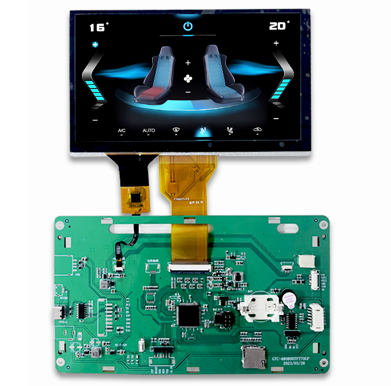
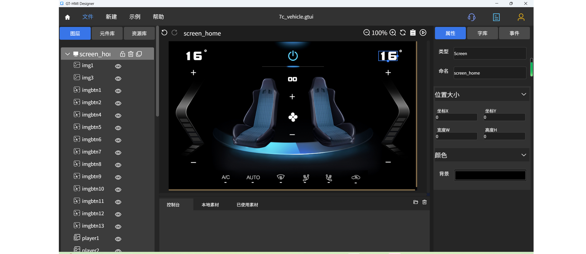
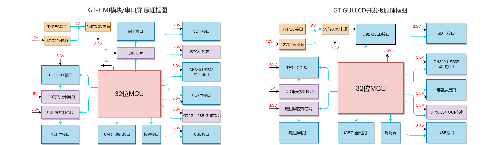
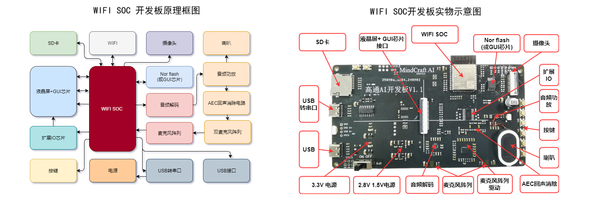

 

    

 

---

#### 介绍
&nbsp;&nbsp;&nbsp;&nbsp;&nbsp;&nbsp;&nbsp;&nbsp;GT-HMI Builder项目是基于GT-HMI的开源硬件系列，涵盖了GT HMI模块（中大尺寸屏）、GUI-LCD开发板（小尺寸屏）、串口屏硬件开源、WIFI SOC开源硬件，本次更新为开发者提供了一套全面的解决方案，从硬件连接到软件配置，再到界面设计，旨在加速理解GT-HMI 及智匠AI的API 相关硬件的基础功能与示例。通过本项目，开发者可以深入学习如何利用高通GT-HMI平台及智匠AI的API构建多样化的交互式应用。

    

 

#### 实物显示效果

 

    

 

#### 实物对应的Designer仿真

 

    

 

#### HMI模块/GUI LCD开发板硬件原理框图

 

    

 

#### WIFI SOC开发板原理框图及实物图

 

    

 

    

#### 项目架构

<li>1: GT-HMI Module文件夹结构</li>
<table>
 <tr>
  <th style="width:40%">目录</th>
  <th style="width:60%">说明</th>
 </tr>
 <tr>
  <td>GT-HMI Module/</td>
  <td>GUI HMI模块的软硬件资料</td>
 </tr>
 <tr>
  <td>&nbsp;&nbsp;|-GTC-480480TFT40XP/</td>
  <td>GT-HMI 4寸模块的软硬件资料</td>
 </tr>
 <tr>
  <td>&nbsp;&nbsp;|-GTC-480272TFT43XP/</td>
  <td>GT-HMI 4.3寸模块的软硬件资料</td>
 </tr>
 <tr>
  <td>&nbsp;&nbsp;|-GTC-480800TFT70GP/</td>
  <td>GT-HMI 7寸模块的软硬件资料</td>
 </tr>
 <tr>
  <td>&nbsp;&nbsp;|-GTC-1024600TFT101GP/</td>
  <td>GT-HMI 10.1寸模块的软硬件资料</td>
 </tr>
  <tr>
  <td>&nbsp;&nbsp;&nbsp;&nbsp;|-&nbsp;|-Hardware/</td>
  <td>模块参考原理图、PCB</td>
 </tr>
 <tr>
  <td>&nbsp;&nbsp;&nbsp;&nbsp;|-&nbsp;|-board/</td>
  <td>资源文件及代码</td>
 </tr>
 <tr>
  <td>&nbsp;&nbsp;&nbsp;&nbsp;|-&nbsp;|-keil5/board/GTC***/</td>
  <td>模块的程序和相关配置文件</td>
 </tr>
 <tr>
  <td>&nbsp;&nbsp;&nbsp;&nbsp;|-&nbsp;|-*.gtui尾缀文件</td>
  <td>模块的示例工程文件，使用HMI-Designer打开</td>
 </tr>
 <tr>
  <td>&nbsp;&nbsp;&nbsp;&nbsp;|-&nbsp;|-out/</td>
  <td>资源文件及代码（适合非HMI模块用户）</td>
 </tr>
 <tr>
  <td>&nbsp;&nbsp;&nbsp;&nbsp;|-&nbsp;|-screen/</td>
  <td>UI界面交互代码</td>
 </tr>
 <tr>
  <td>&nbsp;&nbsp;&nbsp;&nbsp;|-&nbsp;|-sources/</td>
  <td>图片素材文件</td>
 </tr>
</table>

 

<li>2: Serial Port Example文件夹结构</li>
<table>
 <tr>
  <td>Serial Port Example/</td>
  <td>4.3寸和7寸两款屏的串口示例的软硬件资料</td>
 </tr>
 <tr>
  <td>&nbsp;&nbsp;|-GT-GL240320TFT28-21GP 串口例程/</td>
  <td>4.3寸屏串口示例的软硬件资料</td>
 </tr>
 <tr>
  <td>&nbsp;&nbsp;|-GTC-480800TFT70GP 串口例程/</td>
  <td>7寸屏串口示例的软硬件资料</td>
 </tr>
 <tr>
  <td>&nbsp;&nbsp;&nbsp;&nbsp;|-&nbsp;|-Hardware/</td>
  <td>串口屏DEMO板原理图、PCB</td>
 </tr>
 <tr>
  <td>&nbsp;&nbsp;&nbsp;&nbsp;|-&nbsp;|-Keil5工程/</td>
  <td>串口屏的Keil5工程</td>
 </tr>
 <tr>
  <td>&nbsp;&nbsp;&nbsp;&nbsp;|-&nbsp;|-hmi-project/</td>
  <td>串口示例的HMI-Designer工程文件</td>
 </tr>
 <tr>
  <td>&nbsp;&nbsp;&nbsp;&nbsp;&nbsp;&nbsp;|-&nbsp;|-&nbsp;|-board/</td>
  <td>资源文件及代码</td>
 </tr>
 <tr>
  <td>&nbsp;&nbsp;&nbsp;&nbsp;&nbsp;&nbsp;|-&nbsp;|-&nbsp;|-out/</td>
  <td>资源文件及代码（适合非HMI模块用户）</td>
 </tr>
 <tr>
  <td>&nbsp;&nbsp;&nbsp;&nbsp;&nbsp;&nbsp;|-&nbsp;|-&nbsp;|-screen/</td>
  <td>UI界面交互代码</td>
 </tr>
 <tr>
  <td>&nbsp;&nbsp;&nbsp;&nbsp;&nbsp;&nbsp;|-&nbsp;|-&nbsp;|-sources/</td>
  <td>图片素材文件</td>
 </tr>
 <tr>
  <td>&nbsp;&nbsp;&nbsp;&nbsp;&nbsp;&nbsp;|-&nbsp;|-&nbsp;|-*.gtui尾缀文件</td>
  <td>模块的示例工程文件，使用HMI-Designer打开</td>
 </tr>
 <tr>
  <td>&nbsp;&nbsp;&nbsp;&nbsp;|-&nbsp;|-串口协议.xlsx</td>
  <td>详细描述了串口屏的通信协议</td>
 </tr>
</table>

 

<li>3: GT-GUI LCD文件夹结构</li>
<table>
 <tr>
  <td>GT-GUI LCD/</td>
  <td>1.9、2.8、3.5、7寸GUI LCD的软硬件资料</td>
 </tr>
 <tr>
  <td>&nbsp;&nbsp;|-GT-GL170320T19-S0XC64/</td>
  <td>1.9寸GUI LCD液晶模组的软硬件资料</td>
 </tr>
 <tr>
  <td>&nbsp;&nbsp;|-GT-GL240320TFT28-21GP/</td>
  <td>2.8寸GUI LCD液晶模组的软硬件资料</td>
 </tr>
  <tr>
  <td>&nbsp;&nbsp;|-GT-GL320480T35-S0GC64/</td>
  <td>3.5寸GUI LCD液晶模组的软硬件资料</td>
 </tr>
  <tr>
  <td>&nbsp;&nbsp;|-GT-GL800480T70-S0GC128/</td>
  <td>7寸GUI LCD液晶模组的软硬件资料</td>
 </tr>
  <tr>
  <td>&nbsp;&nbsp;&nbsp;&nbsp;|-&nbsp;|-&nbsp;|-board/</td>
  <td>资源文件及代码</td>
 </tr>
 <tr>
  <td>&nbsp;&nbsp;&nbsp;&nbsp;|-&nbsp;|-Hardware/</td>
  <td>GUI LCD的DEMO板原理图、PCB</td>
 </tr>
 <tr>
  <td>&nbsp;&nbsp;&nbsp;&nbsp;|-&nbsp;|-Keil5/</td>
  <td>GUI LCD的Keil5工程</td>
 </tr>
 <tr>
  <td>&nbsp;&nbsp;&nbsp;&nbsp;|-&nbsp;|-hmi-project/</td>
  <td>GUI LCD示例的HMI-Designer工程文件</td>
 </tr>
 <tr>
  <td>&nbsp;&nbsp;&nbsp;&nbsp;&nbsp;&nbsp;|-&nbsp;|-&nbsp;|-out/</td>
  <td>资源文件及代码（适合非HMI模块用户）</td>
 </tr>
 <tr>
  <td>&nbsp;&nbsp;&nbsp;&nbsp;&nbsp;&nbsp;|-&nbsp;|-&nbsp;|-screen/</td>
  <td>UI界面交互代码</td>
 </tr>
 <tr>
  <td>&nbsp;&nbsp;&nbsp;&nbsp;&nbsp;&nbsp;|-&nbsp;|-&nbsp;|-sources/</td>
  <td>图片素材文件</td>
 </tr>
 <tr>
  <td>&nbsp;&nbsp;&nbsp;&nbsp;&nbsp;&nbsp;|-&nbsp;|-&nbsp;|-*.gtui尾缀文件</td>
  <td>模块的示例工程文件，使用HMI-Designer打开</td>
 </tr>
 <tr>
  <td>&nbsp;&nbsp;&nbsp;&nbsp;|-&nbsp;|数据手册</td>
  <td>内含GUI LCD的电气参数、尺寸、连接方式、驱动代码等</td>
 </tr>
</table>

<li>4: GT-MindCraft Embedded文件夹结构</li>
<table>
 <tr>
  <td>chatbot/</td>
  <td>chatbot开发板的软硬件资料</td>
 </tr>
 <tr>
  <td>&nbsp;&nbsp;|-ESP32 IDF Project/</td>
  <td>chatbot开发板示例ESP32 IDF工程文件</td>
 </tr>
 <tr>
  <td>&nbsp;&nbsp;|-hmi-project/</td>
  <td>chatbot开发板示例GT-HMI 工程文件</td>
 </tr>
 <tr>
  <td>&nbsp;&nbsp;&nbsp;&nbsp;|-&nbsp;|-board/</td>
  <td>资源文件及代码</td>
 </tr>
 <tr>
  <td>&nbsp;&nbsp;&nbsp;&nbsp;|-&nbsp;|-out/</td>
  <td>资源文件及代码（适合非HMI模块用户）</td>
 </tr>
 <tr>
  <td>&nbsp;&nbsp;&nbsp;&nbsp;|-&nbsp;|-screen/</td>
  <td>UI界面交互代码</td>
 </tr>
 <tr>
  <td>&nbsp;&nbsp;&nbsp;&nbsp;|-&nbsp;|-sources/</td>
  <td>图片素材文件</td>
 </tr>
 <tr>
  <td>&nbsp;&nbsp;&nbsp;&nbsp;|-&nbsp;|-*.gtui尾缀文件</td>
  <td>模块的示例工程文件，使用HMI-Designer打开</td>
 </tr>
 <tr>
  <tr>
  <td>&nbsp;&nbsp;|-Hardware/</td>
  <td>chatbot开发板原理图，PCB </td>
 </tr>
</table>

#### 快速开始
<ul>
<li style="margin-bottom: 4px;">硬件准备：
<ul>
<li>客户可参考项目架构中子文件夹内的Hardware文件夹下的硬件资料自己设计PCB板。</li>
<li>也可以使用以子文件夹命名型号的模块或者开发板，如若使用模块或者开发板请拨打0755-83453881联系业务人员</li>
</ul>
</li>
<li style="margin-bottom: 4px;">软件安装：
<ul>
<li>从高通官网www.hmi.gaotongfont.cn下载并安装HMI-Designer软件。用于打开各个子文件夹中的以.gtui扩展名结尾的HMI工程文件。</li>
</ul>
</li>
<li style="margin-bottom: 4px;">移植：
<ul>
<li>如果是使用资料中提供的硬件资料用其他MCU自行设计PCB，需要适配硬件驱动，移植教程详见https://www.hmi.gaotongfont.cn/gthmiengineyzczlc</li>
</ul>
</li>
<li style="margin-bottom: 4px;">其他注意事项：
<ul>
<li>更详细的使用说明请参考各个子文件夹内的README.md文件</li>
</ul>
</li>
</ul>

#### GT-HMI Builder产品路线图
<ul>
<li style="margin-bottom: 4px;">第一弹（已上线）：开源串口屏/液晶屏模组系列，涵盖4寸，4.3寸，7寸，10寸</li>
<li style="margin-bottom: 4px;">第二弹（已上线）：GUI-LCD，适用于小尺寸屏幕的GT-HMI Builder开源硬件系列，包含GUI-LCD以及开发板</li>
<li style="margin-bottom: 4px;">第三弹（已上线）：基于WIFI SOC的开源硬件，可接入高通旗下智匠AI的API，包含大语言模型，视觉识别，语音识别，语音合成等AI服务</li>
<li style="margin-bottom: 4px;">第四弹：待定</li>
</ul>

#### 相关视频教程

**Desinger功能特点**

         GT HMI Designer是一款功能强大的嵌入式人机界面设计软件。它提供直观的可视化设计界面，支持多种常用控件和丰富的交互功能。此外，它还支持多国语言界面设计和强大的仿真功能。通过GT HMI Designer，您可以轻松设计出美观、交互性强的界面，满足各种应用场景的需求。

**Desinger视频教程**

<ul>
<li style="margin-bottom: 4px;"><a href="https://www.bilibili.com/video/BV1Xm4y1h7vs/?spm_id_from=333.999.0.0&vd_source=8ecf13d60f5e8ce6a592b252d351e954">第一章 软件安装与工程创建</a></li>
<li style="margin-bottom: 4px;"><a href="https://www.bilibili.com/video/BV1va4y137ac/?spm_id_from=autoNext&vd_source=8ecf13d60f5e8ce6a592b252d351e954">第二章 简单工程的制作</a></li>
<li style="margin-bottom: 4px;"><a href="https://www.bilibili.com/video/BV1Uo4y1V7pg/?spm_id_from=333.999.0.0&vd_source=8ecf13d60f5e8ce6a592b252d351e954">第三章 控件介绍（上）</a></li>
<li style="margin-bottom: 4px;"><a href="https://www.bilibili.com/video/BV1fs4y1u7uz/?spm_id_from=333.999.0.0&vd_source=8ecf13d60f5e8ce6a592b252d351e954">第四章 控件介绍（下）</a></li>
<li style="margin-bottom: 4px;"><a href="https://www.bilibili.com/video/BV1Ds4y1B7iW/?spm_id_from=333.999.0.0&vd_source=8ecf13d60f5e8ce6a592b252d351e954">第五章 事件交互介绍</a></li>
</ul>

**高通GT-HMI零基础详细教程合集(最新)(推荐)**

<ul>
<li style="margin-bottom: 4px;"><a href="https://space.bilibili.com/3493293474188211/channel/collectiondetail?sid=3764678">高通GT-HMI零基础详细教程</a></li>
</ul>

 

**Engine功能特点**

        GT HMI Engine是一款功能强大、高性能、多平台、多语言、稳定可靠的嵌入式人机界面引擎，提供丰富的控件和强大的交互功能。

**Engine 视频教程**

<ul>
<li style="margin-bottom: 4px;"><a href="https://www.bilibili.com/video/BV1Y24y1N7Bq/?spm_id_from=333.999.0.0&vd_source=8ecf13d60f5e8ce6a592b252d351e954">第六章 下位机工程移植</a></li>
<li style="margin-bottom: 4px;"><a href="https://www.bilibili.com/video/BV1Jh411c7jn/?spm_id_from=333.999.0.0&vd_source=8ecf13d60f5e8ce6a592b252d351e954">第七章 上下位机联动</a></li>
</ul>
 

**智匠chatbot API接口文档**

<ul>
<li style="margin-bottom: 4px;"><a href="https://apifox.com/apidoc/shared-0fd7ea54-919e-4c93-b673-c60219bc82e0/api-213657897">chat bot 参数获取</a></li>
<li style="margin-bottom: 4px;"><a href="https://apifox.com/apidoc/shared-0fd7ea54-919e-4c93-b673-c60219bc82e0/api-213657897">chat_bot_v1 API接口及示例</a></li>
</ul>

 

**智匠AI KEY申请流程**

<ul>
<li style="margin-bottom: 4px;"><a href="https://apifox.com/apidoc/shared-0fd7ea54-919e-4c93-b673-c60219bc82e0/doc-4739665">如何获取API KEY</a></li>
</ul>

 

    <a href="https://www.hmi.gaotongfont.cn/kfgj"
    > 公司官网 </a> |
    <a href="https://space.bilibili.com/3493293474188211/video"
    > B 站教程 </a> |
    <a href="https://www.hmi.gaotongfont.cn/kfgj#/#hmiEngine"
    > Engine 使用手册 </a> |
    <a href="https://www.hmi.gaotongfont.cn/kfgj#/#hmidesigner"
    > Designer 使用手册 </a> |
    <a href="http://isite.baidu.com/site/wjz7qkrv/406a2b0c-f9c7-4a08-a47a-662e862b2af4?ch=48&wid=498ccd5c05334f21a2142ba3cf628964_0_0&field=&orderBy=&categoryId=undefined&title=%E8%81%94%E7%B3%BB%E6%88%91%E4%BB%AC"
    > 联系方式 </a> |
    <a href="https://genitop-1317577547.cos.ap-nanjing.myqcloud.com/GT-HMI/GT-HMI-Groups/GT-HMI%20Communication%20groups.jpg"
    > GT HMI微信交流群 </a>

 

