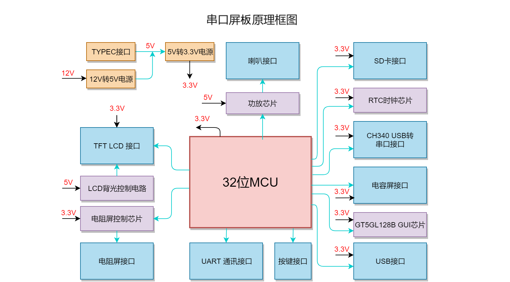

 

    

 

  <a><b>GT-HMI Builder-开源硬件系列</b></a>

  <a><b>致力于低代码开发，多功能，易用的免费嵌入式图形库</b></a>

 

    <a href="https://www.hmi.gaotongfont.cn/kfgj"
    > 公司官网 </a> |
    <a href="https://space.bilibili.com/3493293474188211/video"
    > B 站教程 </a> |
    <a href="https://www.hmi.gaotongfont.cn/kfgj#/#hmiEngine"
    > Engine 使用手册 </a> |
    <a href="https://www.hmi.gaotongfont.cn/kfgj#/#hmidesigner"
    > Designer 使用手册 </a> |
    <a href="http://isite.baidu.com/site/wjz7qkrv/406a2b0c-f9c7-4a08-a47a-662e862b2af4?ch=48&wid=498ccd5c05334f21a2142ba3cf628964_0_0&field=&orderBy=&categoryId=undefined&title=%E8%81%94%E7%B3%BB%E6%88%91%E4%BB%AC"
    > 联系方式 </a> |
    <a href="https://genitop-1317577547.cos.ap-nanjing.myqcloud.com/GT-HMI/GT-HMI-Groups/GT-HMI%20Communication%20groups.jpg"
    > GT HMI微信交流群 </a>

 

---

   <a href="https://www.bilibili.com/video/BV1Ce411X78C/?spm_id_from=333.999.0.0&vd_source=0d93f7ed5a2d40d6e2d321f392d5e6f3"
    > <u><b>本工程视频教程：五步教你设计串口屏，5分钟快速上手</b></u></a>

#### 介绍
&nbsp;&nbsp;&nbsp;&nbsp;&nbsp;&nbsp;&nbsp;&nbsp;GT-HMI Builder是基于GT-HMI的开源硬件系列项目。本次更新提供了一套完整的串口屏解决方案，包括硬件连接、软件配置以及界面设计，旨在帮助开发者快速理解和实现串口屏的基础功能与示例。通过本项目，开发者可以学习如何利用高通GT-HMI平台构建交互式串口屏应用。

#### 硬件框图

    

#### 快速开始
<ul>
<li style="margin-bottom: 4px;">硬件准备：<ul>
<li>客户可参考示例代码中Hardware-Information文件夹下提供的硬件资料自己设计PCB板，</li><li>也可以使用高通GTC-480272TFT43XP模块。</li></ul></li>
<li style="margin-bottom: 4px;">软件安装：<ul>
<li>从高通官网www.hmi.gaotongfont.cn下载并安装HMI-Designer软件。用于打开hmi-project文件夹中的HMI工程文件。</li></ul></li>
<li style="margin-bottom: 4px;">加载示例：<ul>
<li>在HMI-Designer中打开hmi-project文件夹中的工程文件4.3.gtui，可以查看串口屏界面的内容和进行编译。</li><li>工程编译后将board文件夹内的resource.bin文件使用烧录器烧录到自己设计的PCB板中的GUI芯片中，如使用高通的4.3寸HMI模块，则使用SD卡升级即可。</li></ul></li>
<li style="margin-bottom: 4px;">移植：<ul>
<li>如果是使用资料中提供的硬件资料用其他MCU自行设计PCB，需要适配硬件驱动，移植本示例的APP及ui文件夹代码。移植教程详见https://www.hmi.gaotongfont.cn/gthmiengineyzczlc</li></ul></li>
<li style="margin-bottom: 4px;">编译与下载：<ul>
<li>自行设计的PCB，移植好后，编译下载到主控当中，</li><li>如使用高通4.3寸HMI模块，直接编译GTC-480272TFT43XP内的工程，将生成的固件使用SD卡升级到HMI模块的主控当中。</li></ul></li>
<li style="margin-bottom: 4px;">测试运行：<ul>
<li>通过串口调试助手发送命令，观察串口屏的响应和显示。通讯协议详见串口协议.xlsx文档。</li></ul></li>
</ul>

